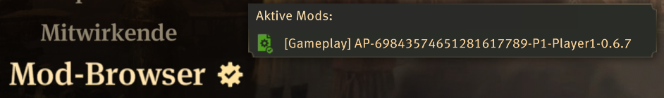

# Anno 1800 Randomizer Setup Guide

[Game Page](en_Anno%201800.md)<!--(/tutorial/Anno%201800/info/en)--> | Setup | [Items](items_en.md)<!--(/tutorial/Anno%201800/items/en)--> | [Locations](locations_en.md)<!--(/tutorial/Anno%201800/locations/en)--> | [Roadmap](roadmap_en.md)<!--(/tutorial/Anno%201800/roadmap/en)-->

## Required Software

* Anno 1800, any one of
  * [Steam](https://store.steampowered.com/app/916440/Anno_1800/)
  * [Ubisoft Connect](https://store.ubisoft.com/us/anno-1800/5b647010ef3aa548048c5958.html?lang=en_US)
  * [Epic](https://www.epicgames.com/store/en-US/product/anno-1800/home)
* Archipelago: [Archipelago Releases Page](https://github.com/ArchipelagoMW/Archipelago/releases)

## Optional Software

* None yet, but I'll create a poptracker pack eventually

## Overview

This guide walks you through installing the Anno 1800 Archipelago mod, configuring an Archipelago slot for Anno 1800,
and playing the game with an Anno 1800 client.

### Defining Some Terms

In Archipelago, multiple Anno 1800 worlds may be played simultaneously.
Each of these worlds must be connected to the Archipelago Server via the Archipelago mod.

This guide uses the following terms to refer to the software:

* **Archipelago Server** - The central Archipelago server, which connects all games to each other.
* **Archipelago Client** - The desktop application used by many Archipelago games as middleware. Accessed via the
  menu point `Anno 1800 Client` in the Archipelago Launcher.
* **Archipelago (Anno 1800) mod** - The Anno 1800 mod which implements Archipelago in-game functionality and
  connectivity. All Anno 1800 players must have this mod installed.
* **Anno 1800** - The Anno 1800 instance (game client) with which players play the actual game.

### What a Playable State Looks Like

* An Archipelago Server
* An Archipelago client, connected to both the Archipelago Server and a modded Anno 1800 instance
* One running modded Anno 1800 instance

## Preparing to Play Anno 1800 Archipelago

### Installing Anno 1800

Purchase and install Anno 1800 via one the sources linked [above](#required-software). You could also purchase some or
all of the DLCs as you desire.

Install Archipelago via the link [above](#required-software).

### Installing Archipelago

Install Archipelago as described in its [setup guide](https://archipelago.gg/tutorial/Archipelago/setup_en).

### Installing the Anno 1800 Custom APWorld

Open the Archipelago Launcher,  select `Install APWorld` and point it to the `.apworld`-file in the download.

Alternatively, take the `.apworld`-file in the download and put it into the `custom_worlds`folder in your Archipelago
installation. If you don't have this folder, create an empty one with the name first.

### Creating a Config (.yaml) File

#### What is a config file and why do I need one?

Your config file contains a set of configuration options which provide the generator with information about how it
should generate your game. Each player of a multiworld will provide their own config file. This setup allows each player
to enjoy an experience customized for their taste, and different players in the same multiworld can all have different
options.

#### Where do I get a config file?

Usually, the Player Options page on the website would allow you to configure your personal options and export them into
a config file. However, this is a custom apworld, so either start your Achipelago Launcher and select
`Generate Template Options` to find a template yaml in your `Players/Templates` subfolder or use the one in the
download. Afterwards, pass it to the host of your game. If that's you, check out the hosting instructions
[below](#hosting-your-own-anno-1800-game).

Alternatively, you can use the `Options Creator` from the Archipelago Launcher for a visual yaml creator. Unfortunately,
it can't enter 0 as an amount in the lists for required population and required skyscrapers, so you have to remove the
ones you don't want if you intend to change any from the default.

#### Verifying Your Config File

If you would like to validate your config file to make sure it works, you may do so on the
[Yaml Validation Page](https://archipelago.gg/check)<!--(/check)-->.

### Installing the Archipelago Mod

The host of the Archipelago multiworld should supply you with a zip file name `AP-%1-P%2-%3-%4.zip`, where `%1` is the
seed number, `%2` is the slot number, `%3` is the slot name and `%4` is the Archipelago version this mod was created by.

Before installing mods, Anno 1800 must have been started and closed at least once. Then, you can create the following
folder (depending on your launcher):
* `...\Ubisoft Game Launcher\games\Anno 1800\mods` (Ubisoft Connect and Epic)
* `...\Steam\steamapps\common\Anno 1800\mods` (Steam)

The exact location might be different if you changed the folder your launcher installs games to, but there should be a
`Bin` and a `maindata` folder next to your `mods` folder - that means you're in the right spot.

After another game start, there should be a popup about mod use, which must be accepted. Now the game can be closed
again. If there was no popup, it will appear after you first install a mod.

To install the mod, extract the zip file and move or copy the resulting folder into the folder you created above. The
resulting folder structure should look like `mods\AP-%1-P%2-%3-%4\modinfo.json`.

**Important**: Do **NOT** install the mod in your `...\Documents\Anno 1800\mods` folder - the game will not find this
path.

If this worked, then Anno 1800 should display a gear next to the main menu point `Mod Browser`. If you hover over it,
it should display `[Gameplay] AP-%1-P%2-%3-%4` (might be cut off due to length) like so:

There should only ever be one Anno 1800 Archipelago mod installed at a time - otherwise, the Archipelago Client will
connect to the first one it finds while the game will try to load all of them.

### Installing Additional Mods

You can install additional mods by adding them to the same folder or via the Mod Browser / mod.io. Note that there may
be compatibility issues if other mods modify the game's unlocks. If other mods add new building unlocks, they will not
be modified and work as usual though they may break the logic.

For a list of supported and compatible mods, see [below](#other-mods).

## Running and Connecting the Game
Start a new Anno 1800 free play game or load into your existing savegame. Singleplayer or multiplayer should both
work the same, none of the standard singleplayer questlines will trigger. The campaign and scenarios won't work.

For the starting conditions, make sure to turn on all DLCs that were selected in the player options for your world.
Also, for all game settings available as player options in your yaml file, match them during game setup.
Currently, the other starting conditions do not really matter, but here are a few recommendations:
* Turn off all other DLCs. Should you keep any on, they will unlock as normal
  * Especially don't turn on Docklands, unless you want the option to skip everything
* Turn off all NPC players - you are not guarantueed to get weapons and may not be able to defend yourself
* Turn off pirates - you are not guarantueed to get luxury goods and money might be tight
* With the exception of some expedition items, you probably shouldn't buy goods at NPC shops, as this also
circumvents logic
* You probably don't want to set any victory conditions in Anno itself - or at least continue playing afterwards if your
Archipelago victory has not been achieved yet

Be careful not to load into vanilla savegames or those from other modding setups as this mod will likely trigger some
irreversible unlocks. Once loaded into the savegame, the client should print that it is connected to the game within a
few seconds. 

Then start the Archipelago Client. If it's your first time launching, it will ask for the Anno 1800 mods folder. Point
it to the folder you installed the mod to [above](#installing-the-archipelago-mod). On Windows, if Anno is located in
a protected folder, it may be necessary to start the client as administrator.

If you ever need to change this path, you can find it in your Archipelago folder in the `host.yaml` file under
`a1800_options`, named `a1800_mods_folder_path`.

Due to the way Anno 1800 simulates game ticks, the client will only be able to connect to the game while the game is
running and not paused (neither gamespeed pause nor menu pause). If you pause, it will disconnect. This not a problem
and the client will reconnect briefly after unpausing the game.

Once the client has successfully connected to Anno 1800, you can connect to the Archipelago Server by entering the
server's ip and port and clicking `Connect` or typing `/connect <ip>:<port>` in the client. If you haven't connected
the client to Anno during this session yet, you will receive an error telling you to do so first.

It's also possible to play the game asynchronously without server or client. In this case, everything will be synced
once you connect the next time. If Anno 1800 is the only slot in the multiworld, you can even forgo the client and
server entirely and just locally play a randomized game - all unlocks will happen standalone.

## Hosting Your Own Anno 1800 Game

If you're hosting your own Anno 1800 game, you will need to configure and generate an Archipelago world.

### Generating and Hosting the Multiworld

Generating a game and hosting an Archipelago server is explained in the
[Archipelago Setup Guide](https://archipelago.gg/tutorial/Archipelago/setup/en)<!--(/tutorial/Archipelago/setup/en)-->.

## Allowing Other People to Join Your Game

Additional players can join your game using the game's built-in multiplayer functionality if you start a multiplayer
session. Co-op play works as normal, but if you join as separate players, all unlocks will be shared - whoever reaches
unlocks an unlock first, triggers the location check and all players will receive all unlocks.

Have anyone you want to join follow the 
[Preparing to Play Anno 1800 Archipelago](#preparing-to-play-anno-1800-archipelago) section above. If you're using any
additional mods, all other players need to use the same mods as you.

However, only one player should to use the Archipelago client.

Note: Co-op was successfully tested, but multiplayer with separate players is as of yet untested.

## Other Mods

Find other mods mostly on [mod.io](https://mod.io/g/anno-1800), with some on nexus or github. The following lists
always refer to the name on mod.io. Note that many mods assume the player has all DLCs.

### Supported Mods

The following mods are supported, but must be enabled in the config yaml:
* Mine Slot Unification (Taludas) - v1.2.2

### Compatible Mods

The following mods are compatible with the randomizer and should not cause any issues:
* Adjustments for HighLife Goods (Taludas) - v1.1
* Attractiveness Rebalancing \[Spice It Up\] - v1.0.2
* Bigger Gas Pump Radius \[Spice It Up\] - v1.0.1
* Bigger Harbour \[Spice It Up\] - v1.0.3
* Bigger Oil Pump Radius \[Spice It Up\] - v1.0.1
* \[Devtool\] Console - v1.0.5
* Dockland Speed (Kurila) - v1.5.1
* Fam's More Unique Icons - v1.0.0
* Fancy Billiardtables (Taludas) - v1.0.0
* Faster Constructions (Kurila) - v1.6.1
* \[Fix\] Community Patch - v1.025
* Fix for feedbackunit Texture bugs (Taludas) - v1.0.0
* Free Farmfield Placement (Taludas) - v3.1.1
* Harbor Blocking \[Spice it Up\] - v1.0.1
* Mine Infolayers \[Spice it Up\] - v1.0.1
* NW Expanded (Taludas) - v2.0.0a
* Royal Taxes Removed \[Spice It Up\] - v1.0.1

If you think any mods are missing from this list, please inform me here or on either the Archipelago or Anno Modding
discord and I will take a look.

## Frequently Asked Questions

### Does this work with Proton/Linux?

If you managed to get your Anno 1800 running under Linux, the mods folder in the user directory will be inside Anno
1800's wine prefix. Everything else should behave the same as under Windows. The Archipelago client will expect a Linux
path to your mods folder, which might be inside the same wine prefix. The file browser should work for selecting the
path correctly.

## Troubleshooting

### Connectivity Issues

If you have issues connecting the Archpelago Client to the game, especially on Windows, make sure to do everything in
the right order:
* Close the Archipelago Client and Launcher if they are still open.
* Open the game and load a save file. Explicitly reload the savefile if it is already open from previous attempts.
  * Leave the game unpaused until a connection is established.
  * Waiting on a finihsed loading screen is not enough, the actual game must be running.
* Open the Archipelago Launcher and start the Anno 1800 Client.
  * The Client should now connect and tell you that it got "world information" after a short moment.
* Connect the Client to the Archipelago Server by entering the Server's IP and port.
