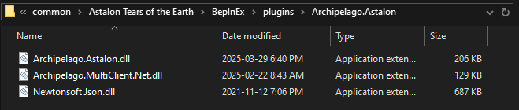

# Astalon: Tears of the Earth for Archipelago Setup Guide

## Required Software

- [Astalon: Tears of the Earth](https://store.steampowered.com/app/1046400/Astalon_Tears_of_the_Earth/)
  - Only the Steam version has been tested
- [BepInEx IL2CPP v6 x86](https://builds.bepinex.dev/projects/bepinex_be)
  - It must be the x86 version, the x64 version won't work
  - Currently you must use the bleeding edge release of v6 since the stable version does not support IL2CPP. A direct download for the version tested against can be found [here](https://builds.bepinex.dev/projects/bepinex_be/688/BepInEx-Unity.IL2CPP-win-x86-6.0.0-be.688%2B4901521.zip).
- [Archipelago Mod for Astalon](https://github.com/drtchops/Archipelago-Astalon/releases/latest)

## Optional Software

- [Universal Tracker](https://github.com/FarisTheAncient/Archipelago/releases)
  - Includes integrated map tracking
- (Outdated) [PopTracker](https://github.com/black-sliver/PopTracker/releases) & [Astalon Pack for PopTracker](https://github.com/Ouro-dev/astalon-poptracker/releases/latest)
  - The current latest release v0.2.1 does not fully support Astalon mod versions past v0.10.0

## Installation

1. Download and extract BepInEx into your Astalon install folder.
2. Download and extract the Archipelago Mod into your Astalon install folder.

After installing, your game folder should contain a `BepInEx` folder, like this:

<!--  -->

Inside of `BepInEx/plugins/Archipelago.Astalon` should look like this:

<!--  -->

## Connecting

1. Launch the game. It will take longer to open the first time after installing BepInEx as it needs to generate some files.
2. There will be a place to input your connection details in the bottom right corner of the screen. Enter the archipelago server address and port, your player name, and a password if required, and press connect.
3. Once connected, the bottom corner will switch to showing your connection status. A console that shows you any messages from AP will appear at the top of the screen. You can click the show button to expand it and send messages.
4. Start a new save file in any slot.
5. Items should send out and display an item box in-game when you check locations. Received items should automatically be added to your inventory and an item box will be displayed.

## Resuming

You can load an existing save and it will automatically reconnect to the same AP server. If you need to change the port, manually connect to the new server on the main menu before loading your save.

Once you're loaded in and connected you will receive any items that were sent since you last played. Quitting to the main menu will disconnect you automatically.

## In-Game Controls

Once you've connected to AP you can press F1 to open a set of debug options. If you're softlocked you can use this menu to die and respawn or warp to a previously used campfire.

## Disabling the Mod

If you would like to turn off the mod entirely, open `Astalon Tears of the Earth/BepInEx/config/Archipelago.cfg` in a text editor, find where it says `enabled = true`, and change it to `enabled = false`. If the game is currently open you'll have to restart it.

## Known Issues

- There's currently no softlock prevention. If you get stuck you can use the debug menu to respawn or warp to a campfire.
- The logic does not properly handle tracking which characters can access individual rooms. You may run into an issue where you can physically reach a magic crystal or face switch, but not with a character that can actually activate it.

## I have the mod setup, how do I start a seed on Archipelago?

Since Astalon is still an unsupported game, creating a game on Archipelago is a little involved.

1. Install the latest version of Archipelago onto your computer
   - Setup guide: <https://archipelago.gg/tutorial/Archipelago/setup/en>
   - This guide covers Archipelago in detail, what you're most interested in is `Installing the Archipelago Software`
2. Download the `astalon.apworld` from the mod's latest release and double click it to install
   - If it doesn't automatically install, you can manually place it in `Archipelago/custom_worlds`
   - You can find this folder by opening the Archipelago Launcher and clicking Browse Files
3. Download the `Astalon.yaml` from the mod's latest release, put it in `Archipelago/Players`, open it in a text editor, and change any options as desired
   - There is a guide describing how the Archipelago YAML format works: <https://archipelago.gg/tutorial/Archipelago/advanced_settings/en>
4. If you're playing with other people, get their yaml files and also put them in `Archipelago/Players`
5. Open the Archipelago Launcher again and click Generate to create your seed
6. Go to <https://archipelago.gg/uploads> and upload the newly generated file from `Archipelago/output`
7. Once it's generated, click `Create a New Room` to start up an Archipelago server you can connect to
8. Connect to the server using the address from the new room (something like `archipelago.gg:38281`) and the player name you entered into your yaml
