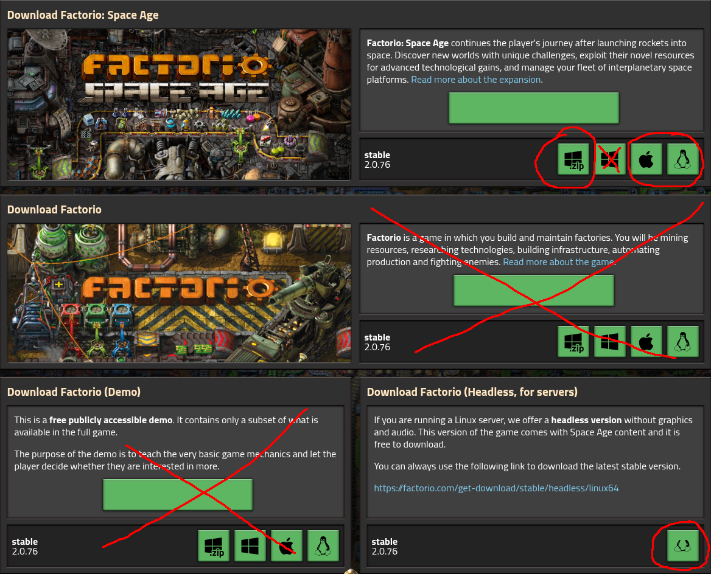

# Factorio: Space Age Randomizer Setup Guide

Factorio integration into Archipelago is a bit complex due to limitations in Factorio's modding API.
A minimum of 2 instances of Factorio must be running in a multiplayer client+server configuration, even if you're playing Factorio by yourself.
If you know how to do port forwarding (or host a LAN party), you can invite others to play Factorio multiplayer in Archipelago!
From Archipelago's perspective, the Factorio world is a single "player" regardless of the number of Factorio players connecting to your Factorio world.

Due to this complex multiplayer-within-multiworld situation, it's important to define some terminology for the rest of this guide:

* Factorio Player: A person running Factorio's normal graphical interface. One or more Factorio Players connect to the Factorio Host via the Multiplayer menu in game.
* Factorio Host: The headless Factorio server managed by the Archipelago Client.
* Archipelago Client: Software bundled as `factorio_space_age.apworld` that runs within the context of the Archipelago software suite.
* Archipelago Server: Connects multiple different games together in a multiworld. This component is beyond the scope of this document.

## Required Software

For the Factorio Player(s):
- [Factorio](https://factorio.com) with the Space Age expansion.
    - Obtained via: factorio.com, Steam, GOG
- Recommended: Respawn to Any Planet mod: https://mods.factorio.com/mod/respawn-to-any-planet
- (Later in the process) a custom built Factorio mod generated for the multiworld.

For the Factorio Host:
- [Factorio](https://factorio.com) with the Space Age expansion.
    - Obtained via https://factorio.com/download
    - *Not* the Steam version as the DRM interferes with the process.
    - *Not* the Demo version. You must login to factorio.com to get the correct download links.
    - The special Headless Linux build will work for this if the Host is a Linux machine.
- Recommended: Respawn to Any Planet mod: https://mods.factorio.com/mod/respawn-to-any-planet
- The [Archipelago](https://github.com/ArchipelagoMW/Archipelago/releases) software suite.
- This `factorio_space_age.apworld` installed into the Archipelago installation.
- (Later in the process) the same custom built Factorio mod mentioned above.

## Create a Config (.yaml) File

This process is the same for all Archipelago games.

### What is a config file and why do I need one?

Your config file contains a set of configuration options which provide the generator with information about how it
should generate your game. Each player of a multiworld will provide their own config file. This setup allows each player
to enjoy an experience customized for their taste, and different players in the same multiworld can all have different
options.

### Where do I get a config file?

Try the yaml creator built into Archipelago?

## Factorio Host Guide

### First-Time Setup

To play Factorio with Archipelago, the `factorio_space_age.apworld` must run a multiplayer Factorio server with no DRM.
The Host installation of Factorio must not be the Steam version of the game.
The recommended way to install a second Factorio on your computer is to download the Factorio installer file directly from
factorio.com: [Factorio Official Website Download Page](https://factorio.com/download).
Even if you normally play Factorio with no DRM, it is recommended to create a second installation to keep the automatically managed  configuration separate from your main Factorio installation.

#### If you purchased Factorio on Steam, GOG, etc.

You can register your copy of Factorio on factorio.com: [Factorio Official Website](https://factorio.com/). You will be
required to create an account, if you have not done so already. As part of that process, you will be able to enter your
Factorio product code. This will allow you to download the game directly from their website.

#### Download the Standalone Version

Download the installer by clicking on the button appropriate to your operating system, and extract the folder to a convenient location.
The best place to do this for Archipelago is to place the extracted game folder into the `Archipelago` directory and rename it to just be "Factorio".



Next, you should launch your Factorio Server by running `factorio.exe`, which is located at: `bin/x64/factorio.exe`.
You may be asked to log in to your Factorio account using the same credentials you used on Factorio's website.
After you have logged in, you may close the game.
This login step is not necessary for the special headless build of Factorio for Linux.
This step is necessary so that the `factorio_space_age.apworld` software can start and stop the Factorio server automatically.

#### Configure your Archipelago Installation

If you did not place the Factorio standalone in your Archipelago installation, you must modify your `host.yaml` file 
inside your Archipelago installation directory so that it points to your standalone Factorio executable. Here is an 
example of the appropriate setup, note the double `\\` are required for Windows paths:

```yaml
factorio_options:
  executable: C:\\path\\to\\factorio\\bin\\x64\\factorio
```

### Starting the Factorio Host

Once the multiworld is generated:

1. Acquire the **Archipelago mod** for this seed. It should be named `AP-*.zip`, where `*` is the seed number and slot name.
2. Obtain the **Archipelago Server address** from the website's host room, or from the server host.
3. Copy the mod file into your Factorio server `mods` folder.
4. Run the Archipelago Launcher, and run the `Factorio: Space Age Client`.
5. Enter to the Archipelago Server address by typing `/connect [address:port]` into the input box and press "Enter"


### Allowing Other People to Join Your Game

If you are hosting for multiple Factorio Players, then:

1. Configure your router to forward port `34197` to the computer running the Factorio Host.
2. Obtain your public IP address, such as by visiting [WhatIsMyIP Website](https://whatismyip.com/).
3. The IP address is the Factorio Host address. Provide it to anyone you want to join your game.

## Factorio Player Guide

Once the Factorio Host is running:

1. Acquire the **Archipelago mod** for this seed. It should be named `AP-*.zip`, where `*` is the seed number and slot name.
2. Get the **Factorio Host address** (*not* the Archipelago server address).
    * If you're the only Factorio Player and the Factorio Host is on the same machine, the Factorio Host address is `localhost`.
    * If you're the only Factorio Player and you don't think you need to run a server, you do. See above.
3. Copy the mod file into your Factorio `mods` folder, which by default is located at:  
    * Windows: `C:\Users\<YourUserName>\AppData\Roaming\Factorio\mods`
    * Mac: `~/Library/Application Support/factorio/mods`
    * Linux: `~/.factorio/mods`
4. Launch Factorio normally.
5. Click on "Multiplayer" in the main menu.
6. Click on "Connect to address".
7. Enter the **Factorio Host address** into this box.
8. Click "Connect".

For additional client features, issue the `/help` command in the Archipelago Client.
Once connected to the AP server, you can also issue the `!help` command to learn about additional commands like `!hint`.
For more information about the commands you can use, see the [Commands Guide](/tutorial/Archipelago/commands/en) and
[Other Options](#other-options).

## Other Options

### filter_item_sends

By default, all item sends are displayed in-game. In larger async seeds this may become overly spammy.
To hide all item sends that are not to or from your factory, do one of the following:
- Type `/toggle-ap-send-filter` in-game
- Type `/toggle_send_filter` in the Archipelago Client
- In your `host.yaml` set
```
factorio_options:
  filter_item_sends: true
```

### filter_connection_changes

By default, all player joined and player stopped tracking notifications are displayed in-game. In larger async seeds this may become overly spammy.
To hide all connection changes, do one of the following:
- Type `/toggle-ap-connection-change-filter` in-game
- Type `/toggle_connection_change_filter` in the Achipelago Client
- In your `host.yaml` set
```
factorio_options:
  filter_connection_changes: true
```

### bridge_chat_out
By default, in-game chat is bridged to Archipelago. If you prefer to be able to speak privately, you can disable this
feature by doing one of the following:
- Type `/toggle-ap-chat` in-game
- Type `/toggle_chat` in the Archipelago Client
- In your `host.yaml` set
```
factorio_options:
  bridge_chat_out: false
```
Note that this will also disable `!` commands from within the game, and that it will not affect incoming chat.

## Troubleshooting

In case any problems should occur, the Archipelago Client will create a file in the `/logs` folder.
The contents of this file may help you troubleshoot an issue on your own and is vital for requesting help from other people in Archipelago.

## Why is this so complex?

The Factorio modding API has many rich features, but network access is not one of them.
In order to connect to the Archipelago Server or really any external program, the "rcon" interface must be used.
The Archipelago Client for Factorio bridges communication between the Factorio process and the Archipelago WebSocket server.
In order to use the rcon interface, Factorio must be run as a multiplayer server (TODO: is this really true?) by the Archipelago Client.
This is why you must have a separate DRM-free Factorio installation and use the multiplayer experience.

The reason that every multiworld needs a freshly generated mod is that it is simply not possible to change the names of technologies at runtime.
This also means the !hint command will never reveal technologies in-game, because it's simply not possible.
There are many other similar limitations that require the details of the multiworld slot to be known when Factorio is booting up,
long before any kind of runtime interaction with another process.

Factorio's modding API was designed for a high-performance simulation by skilled nerds.
You must learn the way of the nerd to mod Factorio to your will.
The factory must grow.
