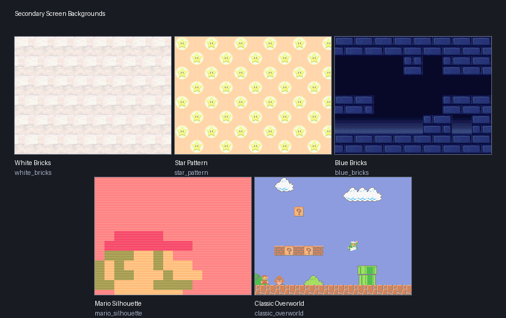

# New Super Mario Bros. DS

This Archipelago world turns **New Super Mario Bros. DS** into a multiworld
randomizer. Clearing levels and finding secrets sends items to you or to other
players. In return, your own world access, abilities, Power-Ups, and Star Coins
may be found anywhere in the multiworld.

**[Roadmap](https://github.com/Lemix028/Archipelago-NewSuperMarioBrosDS/blob/nsmbds/worlds/nsmbds/docs/Roadmap.md)**

For installation and launch instructions, see the [Setup Guide](setup_en.md).

> **Unstable:** This unstable-release may contain severe performance, tracking,
> feature, or logic issues. Report reproducible issues.

## What is randomized?

With the standard location settings, a seed includes:

- all 80 level goals;
- all 9 Castle boss defeats as separate checks;
- all 240 Star Coins;
- 34 Toad House rewards;
- 29 Red Coin Challenges;
- 51 hidden or flying 1-Up Blocks;
- 18 Secret Exits, including the special Mini-Mario exits in the World 2 and
  World 5 castles.

Most categories except level goals and Star Coins can be disabled in your
player options. **Star Coins are always included.** Picking up a Star Coin in a
level immediately commits it to that level's save data and sends a check. It
therefore stays collected even if you die or return to the map before reaching
the goal. The Star Coin item found for you becomes currency for overworld signs
and may count toward your goal.

### Blocksanity

Blocksanity adds up to over 1,100 Coin and Power-Up Blocks as extra checks. It is
disabled by default because it greatly increases the size of the seed. A few special blocks are still missing, such as hanging blocks.

The flying-block room in World 6-2 contains 128 flying-block checks and can also be included. 
These checks never contain progression items for the local player, 
and at most 16 can be global checks for other players. The remaining checks contain local filler or traps.

## Goals

You can choose one of four victory conditions:

| Goal | How to win |
|---|---|
| Defeat Bowser | Defeat Bowser & Bowser Jr. in World 8-Bowser's Castle |
| Star Coin Hunt | Receive the chosen number of Star Coin items |
| World Tour | Defeat all 9 Castle bosses |
| Completionist | Defeat all 9 Castle bosses and receive the chosen number of Star Coin items |

Star Coins spent at signs still count toward Star Coin Hunt and Completionist.
Only your current spending balance goes down. The overview section in the client shows the total amount received so far.

## Progression items

### World Passes

The Desert, Isle, Jungle, Glacier, Mountain, Cloud, and Volcano Passes unlock
Worlds 2 through 8. A later world may therefore become available before you
finish every earlier level.

### Tower and Castle Keys

When enabled, every Tower and Castle has its own matching Key. Worlds 6 and 8
therefore have separate Keys for Tower 1 and Tower 2, while World 8 has separate
Keys for its Castle and Bowser's Castle. You must receive the matching Key before
passing its locked route. This option can be disabled for a more vanilla-like
overworld.

### Star Coin gates

In every mode, gates are arranged in tiers. Early tiers are cheaper and later
tiers require more received Star Coins:

- **Vanilla:** collect enough Star Coins to open each tier.
- **Progressive:** collect Star Coins and Progressive Gate Passes to unlock the
  tiers one after another.
- **Individual:** collect Star Coins and the matching named Gate Pass for each tier.

### Power-Up Permits

Permits can lock the use of Mushrooms, Fire Flowers, Blue Shells, Mini
Mushrooms, Mega Mushrooms, and the touchscreen reserve pocket. When a Permit
option is enabled, you must find that Permit before using the ability.
Power-Ups simply disappear when collected if you don't own the permit yet. 
Item-based Power-Ups are queued up until you unlock the permit.

## Items you can receive

| Item | What it does |
|---|---|
| Mushroom | Gives a Mushroom |
| Fire Flower | Gives a Fire Flower |
| Blue Shell | Gives a Blue Shell |
| Mini Mushroom | Gives a Mini Mushroom |
| Mega Mushroom | Gives a Mega Mushroom |
| Starman Buff | Grants 15 seconds of invincibility |
| 1-Up Mushroom | Adds one life |
| 3-Up Moon | Adds three lives |
| Small Coin Bundle | Adds 10 Coins |
| Coin Bundle | Adds 25 Coins |
| Large Coin Bundle | Adds 50 Coins |
| Time Capsule | Adds 30 seconds to the current level |
| Starman Lite | Grants five seconds of invincibility |
| Trap Shield | Blocks the next trap; several charges can be stored (Cyan Shield) |
| Small Care Package | Adds time, Coins, and one life |
| Life Insurance | Prevents the next death from consuming a life (Green Heart) |

If your reserve pocket is full, a received Power-Up waits until it can be
delivered. It is not lost.

The **Power-ups** list at the bottom of the client's Overview shows your
waiting power-ups. Click **Next** to reserve one copy for the next
empty pocket, or click the selected power-up again to cancel. After delivery,
the oldest available power-up is next automatically. Power-ups awaiting a
Permit stay queued and show their requirement. Your selection and backlog
are saved for this seed and slot across client restarts.

## Item placement

1-Up Blocks and Blocksanity checks have three placement choices:

| Setting | What may be placed there |
|---|---|
| Excluded | Filler items and traps only |
| Non-Progression | Filler, repeatable Power-Ups, useful items, and traps |
| Progression | Any item, including important progression |

Blocksanity uses **Non-Progression** by default, so blocks may contain Power-Ups
without hiding required world access in one of hundreds of blocks. 1-Up Blocks
also use **Non-Progression** by default.

The Blocksanity global percentage controls how many of these checks may hold
items for other players. The remaining blocks contain local filler or traps.

### Location groups

For Archipelago options that accept location groups, such as
`exclude_locations`, this world provides the following category names:

- `Star Coins`
- `Secret Exits`
- `Red Coin Challenges`
- `1-Up Blocks`
- `Blocksanity`
- `Toad Houses`

These groups let you refer to a whole category instead of listing each location.
They do not enable categories that are disabled in your seed options. Excluding
a location from progression placement does not remove its check from the game.

## Traps

The trap percentage controls how often traps replace ordinary non-progression
items. The `traps` YAML list selects the allowed types. An empty list disables
all traps, regardless of the configured percentage. The `filler_items` list
works the same way for positive filler categories, but must keep at least one entry.

| Trap | Effect |
|---|---|
| Super Speed | Makes Mario move much faster |
| Slowness | Makes Mario move more slowly |
| Slippery Gloves | Temporarily disables wall jumps |
| Ground Bound | Temporarily prevents jumping |
| Hyper Confusion | Reverses left and right |
| No Sprint | Temporarily disables sprinting |
| Button Swap | Swaps the jump and sprint buttons |
| Ice Shoes | Makes stopping and turning slippery |
| Heavy Mario | Lowers jumps and makes Mario fall faster |
| Can't Stop | Forces Mario to keep running |
| Sticky Buttons | Briefly keeps released directions held |
| Camera Drift | Pulls the camera to one side |
| Screen Flip | Turns both DS screens upside down |
| Drunk Camera | Makes the camera sway left and right |
| Boo Curse | Repeatedly reverses horizontal controls |
| I'm Stuck | Holds Mario in place for three seconds |
| Screen Tint | Covers the game with a colored tint |
| Retro Filter | Adds an old-screen color and scanline effect |
| Spotlight | Darkens everything outside a small visible area |
| Pixelation | Makes the game view appear pixelated |
| Ground Clap | Ground pounds damage Mario for a short time |
| Head Bonk | Hitting a block from below damages Mario |
| Bonk Trap | Immediately damages Mario |
| Coin Tax | Removes up to ten Coins |
| Time Drain | Removes 50 seconds from the level timer |
| Coin Thief | Removes all normal Coins |
| No Turnaround Trap | Locks horizontal movement to the first chosen direction for 15 seconds |
| Power-Up Pickpocket Trap | Immediately steals the touchscreen reserve Power-Up |

Most timed traps last 15 seconds. The Spotlight lasts ten seconds and I'm Stuck
lasts three seconds. Bonk Trap can optionally be allowed to kill Small Mario.

## Death Link

Death Link shares deaths with other participating players. 
When enabled, your death can defeat them and their deaths can defeat you.  
Life Insurance prevents the next local death from consuming a life. 
The option Death Link: Trigger on Insured Deaths determines whether that insured death is still sent through Death Link. 
It is disabled by default.

Incoming Death Links can be customized with four additional options:

- **Grace Percentage** is the chance to ignore an incoming Death Link completely.
  It is rolled exactly once when the Death Link arrives. Eligible local deaths
  are still always sent. The range is 0% to 75%, so even maximum grace lets one
  quarter of incoming Death Links through on average. Use Death Link: Off to opt out entirely.
- **Cooldown Seconds** ignores further incoming Death Links for the configured
  time after an accepted effect is successfully applied. Death Links received
  while an effect is already queued are also ignored rather than accumulated.
- **Effect** can defeat Mario, apply normal damage, remove 100 seconds from the
  level timer, remove all normal Coins, or randomly choose one of those four
  effects. Damage removes a Power-Up and defeats Small Mario. Timer Drain can
  reduce the timer to zero and therefore can also be lethal.
- **Random Effects** selects which of the four concrete effects may be chosen
  when Effect is set to Random. At least one effect must remain enabled in that mode.

Incoming effects wait until Mario is in an active level. Any death caused by an
incoming effect is suppressed locally and is never sent back as another Death Link.

## Cosmetic options

Mario and Luigi can each use their own color palette. The selected colors are
applied to the character (also the Power Ups) while playing levels; gameplay and abilities do not
change.

Available choices are Vanilla, Crimson, Emerald, Sapphire, Purple, Monochrome,
Pastel Rosa, Gold, Silver, Peach, Random Preset, and Crazy Random. **Random
Preset** chooses one of the prepared palettes for the seed. **Crazy Random**
randomizes every pixel.

The **Secondary Screen Background** option can shuffle the five vanilla
in-level lower-screen wallpapers or use one selected wallpaper in every level.
The available fixed designs are White Bricks, Star Pattern, Blue Bricks, Mario
Silhouette, and Classic Overworld.

## Client and emulator features

The NSMBDS Client can launch BizHawk, the patched ROM, and the included Lua
script for you. During play it shows received items,
checked locations, and notifications.

The patched game unlocks the native **SAVE** option in the World Map menu, so
you can save your current game at any time while on the World Map.

The emulator also displays a configurable activity feed.
It shows checks and item transfers in real time and can be scrolled. The
client's **Settings** tab controls its status, width, screen position, and
fade-out time; changes apply while the game is running. The feed can also be
hidden temporarily with CTRL+SHIFT+H. Reconnecting may
restore older feed messages, but already used lives, Coins, Power-Ups, and traps
are not applied a second time.

### Hotkeys

 - Toggle Emulator Feed: `CTRL+SHIFT+H`

## Important player options

The generated YAML explains every available setting. These are the main groups
you will find there:

- **Goal:** victory condition and required Star Coin total.
- **Locations:** Red Coin Challenges, 1-Up Blocks, Secret Exits, Toad Houses,
  and Blocksanity.
- **Progression:** Star Coin gate mode, Tower/Castle Keys, and Power-Up Permits.
- **Filler:** select which Power-Ups, lives, Coins, bonuses, and protection
  items may appear through one list.
- **Traps:** set the overall percentage and select allowed effects through one list.
- **Multiplayer:** configure Death Link effects, grace, cooldown, and Life Insurance behavior.
- **Cosmetics:** select separate Mario and Luigi palettes and optionally
  shuffle the in-level secondary-screen backgrounds.

Normal host safety limits allow up to 30% global Blocksanity checks and a 50%
trap rate. Higher values require the host to explicitly allow unsafe NSMBDS
options.

## Credits

- **xDesyyx** – Testing
- **Stigimon** – Testing
- **JunoWuno** – Ideas
