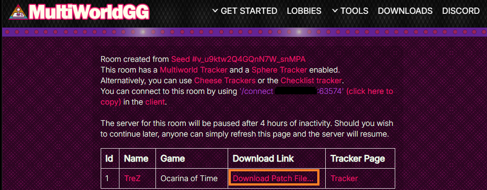

# Setup Anleitung für Ocarina of Time: Archipelago Edition

## Benötigte Software

- Ein Emulator der Wahl
  - [BizHawk] (https://tasvideos.org/BizHawk/ReleaseHistory) (v2.10+)
  - [Project 64](https://www.pj64-emu.com/windows-downloads)
  - [simple64](https://simple64.github.io/)
  - [Rosalie's Mupen GUI](https://github.com/Rosalie241/RMG)
  - [Gopher64](https://github.com/gopher64/gopher64) (Windows/Linux)
  - [ares](https://ares-emu.net/) (Windows/Linux)
  - [RetroArch](https://www.retroarch.com/?page=platforms) (funktioniert auch auf MacOS) 
- Der integrierte Archipelago Ocarina of Time Client, welcher [hier](https://github.com/ArchipelagoMW/Archipelago/releases) installiert
  werden kann.
- Eine `Ocarina of Time v1.0 NTSC-U oder NTSC-J ROM`. (Nicht aus Europa und keine Master-Quest oder Debug-Rom!)

## Konfigurieren des Emulators

- Gute Guides für das Emulieren von OoTR finden sich im offiziellen [OoTR Wiki](https://wiki.ootrandomizer.com/index.php?title=Setup#Emulators)
  - Bitte beachte, dass Dolphin derzeit nicht supported wird.

## Erstelle eine YAML-Datei

### Was ist eine YAML-Datei und Warum brauch ich eine?

Eine YAML-Datie enthält einen Satz an einstellbaren Optionen, die dem Generator mitteilen, wie
dein Spiel generiert werden soll. In einer Multiworld stellt jeder Spieler eine eigene YAML-Datei zur Verfügung. Dies
erlaubt jeden Spieler eine personalisierte Erfahrung nach derem Geschmack. Damit kann auch jeder Spieler in einer
Multiworld (des gleichen Spiels) völlig unterschiedliche Einstellungen haben.

Für weitere Informationen, besuche die allgemeine Anleitung zum Erstellen einer
YAML-Datei: [Archipelago Setup Anleitung](/tutorial/Archipelago/setup/en)

### Woher bekomme ich eine YAML-Datei?

Die Seite für die Spielereinstellungen auf dieser Website erlaubt es dir deine persönlichen Einstellungen nach
vorlieben zu konfigurieren und eine YAML-Datei zu exportieren.
Seite für die Spielereinstellungen:
[Seite für die Spielereinstellungen von Ocarina of Time](/games/Ocarina%20of%20Time/player-options)

### Überprüfen deiner YAML-Datei

Wenn du deine YAML-Datei überprüfen möchtest, um sicher zu gehen, dass sie funktioniert, kannst du dies auf der
YAML-Überprüfungsseite tun.
YAML-Überprüfungsseite: [YAML-Überprüfungsseite](/check)

## Beitreten einer Multiworld

### Erhalte deinen OoT-Patch

(Der folgende Prozess ist bei den meisten ROM-basierenden Spielen sehr ähnlich.)

Wenn du einer Multiworld beitrittst, wirst du gefordert eine YAML-Datei bei dem Host abzugeben. Ist dies getan,
erhälst du (in der Regel) einen Link vom Host der Multiworld. Dieser führt dich zu einem Raum, in dem alle
teilnehmenden Spieler (bzw. Welten) aufgelistet sind. Du solltest dich dann auf **deine** Welt konzentrieren
und klicke dann auf `Download APZ5 File...`.

Führe die `.apz5`-Datei mit einem Doppelklick aus, um deinen Ocarina Of Time-Client zu starten, sowie das patchen
deiner ROM. Ist dieser Prozess fertig (kann etwas dauern), startet sich der Client und der Emulator automatisch
(sofern das "Öffnen mit..." ausgewählt wurde).
Wenn du einen bestimmten Emulator automatisch starten möchtest, setze `oot_options.emulator_path` in deiner `host.yaml`
auf die Emulator-Anwendung. Lasse den Wert leer, um beim ersten Aufruf nach einem Pfad gefragt zu werden.
### Verbinde zum Multiserver

Sind einmal der Client und der Emulator gestartet, verbindet sich der OoT-Client automatisch mit der geladenen ROM.
Du musst keine BizHawk-Lua-Konsole öffnen und kein Connector-Script in das Emulatorfenster ziehen. Falls keine
Verbindung hergestellt wird, stelle sicher, dass die gepatchte ROM in einem unterstützten Emulator geladen ist, und
nutze `/n64` im Client, um den Emulator-Verbindungsstatus zu prüfen.
Für RetroArch musst du `Settings > Network > Network Commands` aktivieren und den Network Command Port auf `55355`
lassen.

Um den Client mit dem Multiserver zu verbinden, füge einfach `<Adresse>:<Port>` in das Textfeld ganz oben im
Client ein und drücke Enter oder "Connect" (verbinden). Wird ein Passwort benötigt, musst du es danach unten in das
Textfeld (für den Chat und Befehle) eingeben.
Alternativ kannst du auch in dem unterem Textfeld den folgenden Befehl schreiben:
`/connect <Adresse>:<Port> [Passwort]` (wie die Adresse und der Port lautet steht in dem Raum, oder wird von deinem
Host an dich weitergegeben.)
Beispiel: `/connect archipelago.gg:12345 Passw123`

Du bist nun bereit für dein Zeitreise-Abenteuer in Hyrule.
