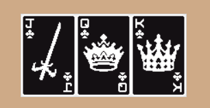
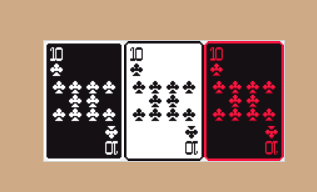

# AP-Rummy Randomizer Setup Guide

## Required Software
- To play
  - Web browser to run [ap-rummy](https://miiroun.github.io/ap-rummy/) (not mobil friendly)
- For hosting
  - [Archipelago](https://github.com/ArchipelagoMW/Archipelago/releases/latest)
  - [Rummy-apworld](https://github.com/Miiroun/Archipelago-NewSuperMarioBrosWii/releases?q=Rummy)

## Install instructions
- The game is run in the web-browser and needs a connection to an archipelago multiworld.
- To play, download the template option yaml and send it to your host
- If you are the host, download the apworld

## How to play
- It follows basic rummy rules
  - You will need to merge at least three cards together, of either same value different colors or a strait of the same color.
  - Se example bellow
- You will need progressive meld and progressive strait of specific length to be able to merge cards with that type.
- Try to merge together as many cards as possible
- Read [glossary](./en_AP-Rummy.md)

# Strait

# Meld

# Controls
- Click to move around cards
- CTRL + Click to merge cards
- SHIFT + Click to separate merges
