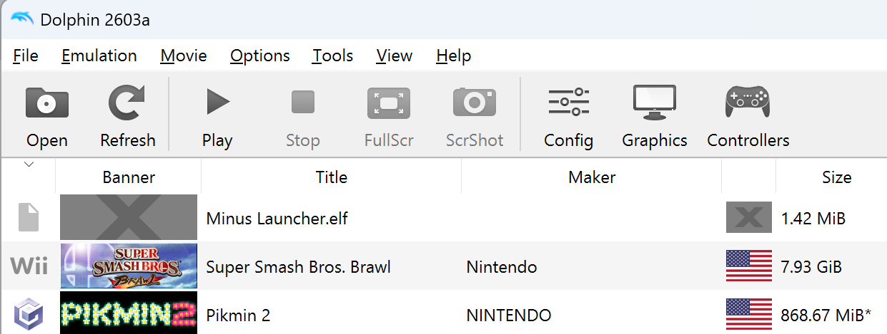
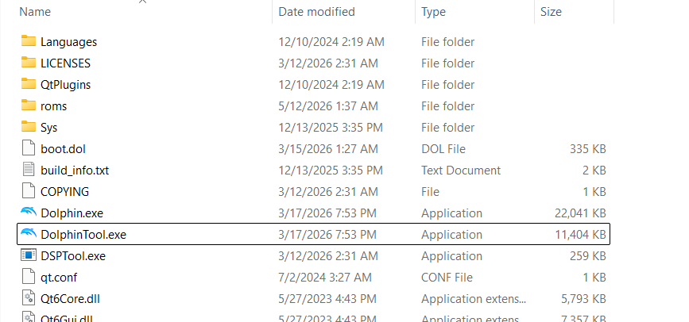
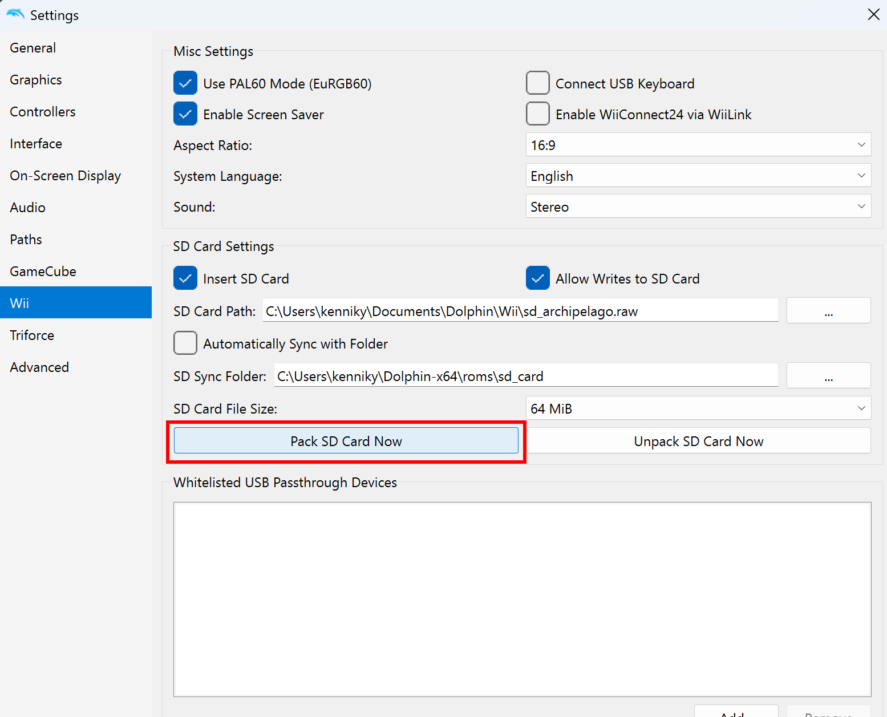
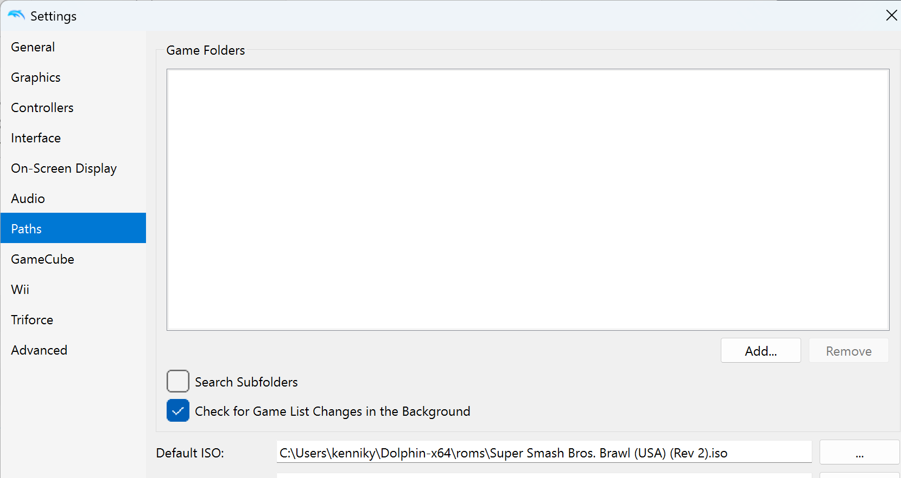

# Prerequisites

- Dolphin: https://dolphin-emu.org/download/
- Archipelago: https://github.com/ArchipelagoMW/Archipelago/releases
- Subspace Emissary APWorld: https://github.com/kenniky/ArchipelagoSSE/releases
- Super Smash Bros. Brawl USA ROM

# Installing the APWorld

Put the `ssbb_sse.apworld` file in the `custom_worlds` folder of your Archipelago installation. You can also just double-click the file to automatically install it.

# Configuring the YAML file

### What is a YAML file and why do I need one?

Your YAML file contains a set of configuration options which provide the generator with information about how it should generate your game. Each player of a multiworld will provide their own YAML file. This setup allows each player to enjoy an experience customized for their taste, and different players in the same multiworld can all have different options.

### Where do I get a YAML file?

Once you've installed the apworld, you can generate a yaml using the `Generate Template Options` button in the ArchipelagoLauncher. It can be found in `Players/Templates` after you have done so. The name of the file will be `Super Smash Bros. Brawl - The Subspace Emissary.yaml`.

If the .yaml file is missing in your `Players/Templates` folder, then please go through the apworld installation steps again, and double check that everything was done correctly.

# Generating a game

You can follow the [official instructions](https://archipelago.gg/tutorial/Archipelago/setup_en#generating-a-game) to generate a game.

# Starting a game

The mod for the Subspace Emissary APWorld uses the same loading method as most Brawl mods. If you've ever modded Brawl in Dolphin before, most of the setup here should be familiar.

1. Download the Dolphin version of [MinimaLauncher](https://forums.brawlminus.net/threads/release-minimalauncher-v1-2.354/) ([Direct link](https://www.dropbox.com/s/9288lgppfw39fs3/Minus%20Launcher.elf?dl=0)). Once you've downloaded this file (it should be called `Minus Launcher.elf`), put it with your ROM files. It should show up in Dolphin now; if it's not there, click `File -> Open` in Dolphin and open it.

    

2. Open the Archipelago Launcher, and then launch the `Subspace Emissary Client` from the launcher. (If it's not there, make sure you installed the APWorld; see [Installing the APWorld](#installing-the-apworld) above.)

3. Within the client, run `/create_sd`. The first time you do this, it will ask you for `DolphinTool.exe` — this is a program that should have been included when you downloaded Dolphin, and is usually located in the same directory as the emulator. **It is not the Dolphin emulator itself.** If you don't have it, you should redownload / reinstall Dolphin; you can also download it standalone [from this repository](https://github.com/ElektroStudios/Dolphin_Emulator_RVZ_ISO_GameCube_Wii_Conversion_Scripts/releases).

    

    It will also ask you for your Super Smash Bros. Brawl ROM. Note that **only NTSC USA ROMs** will work, and other releases will be rejected. (However, both v1.01 and v1.02 are usable.)

    **Note:** At the moment, this APWorld does not support customization, so you can use the same SD card for every run. This means you **do not** have to run `/create_sd` if you've already done it before.

4. When the command finishes, it will inform you of an `sd_card` folder that it has created, usually in the same place that your Brawl ROM is located. Open Dolphin and click on `Config` on the top bar, or go to `Options -> Configuration`. Once in the Settings window, navigate to `Wii` on the left side and you'll see some `SD Card Settings`.

    First, make sure `Insert SD Card` and `Allow Writes to SD Card` are checked. Use the file explorer to set your `SD Sync Folder` to the `sd_card` folder that was created for you. You should also either change the `SD Card Path` or copy the existing `sd.raw` file if you don't want to lose anything on it. You can pick an `SD Card File Size` (for Archipelago, 64 MiB is sufficient) and finally, select `Pack SD Card Now`. This will compress the folder that was created into an SD card that Dolphin can use.

    

5. Keep the Settings window open, and go to `Paths` on the left. Here, set the `Default ISO` to your ISO for Super Smash Bros. Brawl.

    

6. Double click the `Minus Launcher.elf` to start up the game, and enter the server connection info into your client (if you closed it since step 2, just reopen it.). You should then be good to go!

# Questions / Bugs

Refer to the [FAQ](./faq.md), or ask in the thread on the Discord server.
