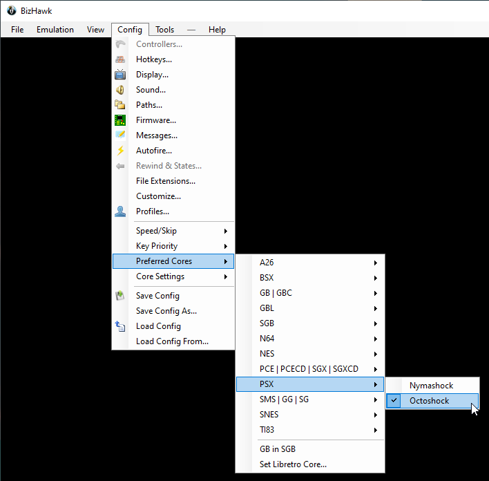

# Tomba! Setup Guide

## Required Software

- [Archipelago](https://github.com/ArchipelagoMW/Archipelago/releases).

- Take the latest APWorld for Tomba! here: [T4g1/ArchipelagoTomba](https://github.com/T4g1/ArchipelagoTomba/releases)

- Either:
   - RetroArch from: [RetroArch](https://retroarch.com?page=platforms) 1.10.3 or newer.
   - BizHawk from: [BizHawk](https://github.com/TASEmulators/BizHawk/releases/latest)

- Your legally obtained Tomba! ROM file, probably named `Tomba! (USA).bin`
The Archipelago community cannot supply you with this.

## Installation Procedures

1. Download and install [Archipelago](<https://github.com/ArchipelagoMW/Archipelago/releases/latest>). **The installer file is located in the assets section at the bottom of the version information.**
2. Put the *.apworld in the custom_games of your instalation

## Create a Config (.yaml) File

### What is a config file and why do I need one?

See the guide on setting up a basic YAML at the Archipelago setup
guide: [Basic Multiworld Setup Guide](/tutorial/Archipelago/setup/en)

### Where do I get a config file?

- Start the Archipelago Launcher
- Select `Options Creator` in the menu
- In the new window, search for Tomba! in the list on the left
- Enter a pseudo/slot name
- Tweak the settings to your liking
- Export the generated options into the `Archipelago/Players` folder

Important: Select the emulator you wish to use in this step

## Generate a game

Once you have your config file(s) in the `Players` folder:
1. Start the Launcher for Archipelago
2. Select `Generate`
3. Once its done, you will have your game generated in the `output` folder as `AP_<something>.zip`

## Host the game

To host a game, you can either:
- **Online**: Upload the zip file on [Archipelago: Host Game](https://archipelago.gg/uploads)
- **Localy**: Click on `Host` in the Launcher

Regardless of the choosen method, you should now have an URL for the client to connect to in the next steps

## Connect to the game

Start the Archipelago Launcher and select the Tomba! client.

The archipelago client serves as the interface between your emulator and the server. You need to tell it what server to connect to. 
If the server is hosted on Archipelago.gg, get the port the server hosts your game on at the top of the game room (last line before the worlds are listed).
In the client, either type `/connect address` (where `address` is the address of the server, for example `/connect archipelago.gg:12345`), or type the address and port on the "Server" input field, then press `Connect`.
If the server is hosted locally, simply ask the host for the address of the server, and copy/paste it into the "Server" input field then press `Connect`.

The client will attempt to reconnect to the new server address, and should momentarily show "Server Status: Connected".

You will need to enter the slot name provided in the config file in order to complete the connection

### Connect to the emulator

At this point, the client will try to connect to the emulator. In order to allows this, you need to configure one.

Currently, Tomba! supports the following emulators:
- RetroArch
- BizHawk

#### RetroArch

You only have to do these steps once. Note, RetroArch 1.9.x will not work as it is older than 1.10.3.

1. Enter the RetroArch main menu screen.
2. Go to Settings --> User Interface. Set "Show Advanced Settings" to ON.
3. Go to Settings --> Network. Set "Network Commands" to ON. (It is found below Request Device 16.) Leave the default
   Network Command Port at 55355. \
   
4. Go to Main Menu --> Online Updater --> Core Downloader. Scroll down and select "Sony - PlayStation (Beetle PSX)".

You can go back to the main menu and select `Load Core`. Select the core you downloaded earlier and then, go on with the next step

#### BizHawk

First off, you need to configure the emulator to use the Octoshock core, to do so:
1. Go to `Config -> Preferred Cores -> PSX`
2. Make sure `Octoshock` is selected \
   

Also, each time you start the emulator, you need to:
1. Open the LUA console: `Tools -> LUA console`
2. Start the connector script: `Script -> Open Script...`
3. Navigate to your Archipelago folder and load: `data\lua\connector_bizhawk_generic.lua`

#### Start the ROM

Using your configured emulator, you can now load the proper Tomba! ROM

Shortly after the ROM is loaded, you should see the client displaying `Connected to <emulator> version X running X`, when this is the case, the connection is succesful.

When the client shows both emulator and Server as connected, you're ready to begin playing. Congratulations on
successfully joining a multiworld game!
