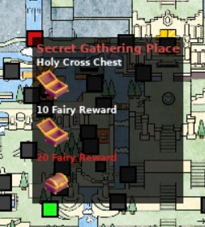

# Map integration

This document describes the requirements to add a map tab to UT. UT uses the [Poptracker](https://github.com/black-sliver/PopTracker/tree/master) specifications for the content of the map tab.

The intent of UT's map tab is to allow world devs to start making a poptracker pack before logic settles into a more stable configuration, however there's enough benefits to UT's integrated tab that it might be worth adding support even if the world already has a dedicated poptracker pack.

## Different approaches

There are three approaches for integrating map support. Each has different trade-offs:

| Approach     | Use Case                                           | Pros                                                     | Cons                                                                    |
|--------------|----------------------------------------------------|----------------------------------------------------------|-------------------------------------------------------------------------|
| **External** | Rely on existing poptracker packs                  | Smaller apworld, use existing community packs            | Requires external pack management and maybe additional location mapping |
| **Hybrid**   | Fixing existing poptracker packs                   | Update JSONs and logic without changing the tracker pack | Requires both apworld and external pack                                 |
| **Internal** | Add the maps and locations directly in the apworld | No external dependencies, easier distribution            | Larger apworld file                                                     |

**Recommendation**: Avoid including map images in the apworld due to copyright and file size concerns. Use either the external or hybrid approach depending on whether your pack's JSON names need adjustment.

## The Basics of adding a map page

By defining a dict with the following fields, the world informs UT that a poptracker pack should be loaded

```py
from typing import ClassVar


class MyWorld(World):
    tracker_world: ClassVar[dict[str, Any]] = {
        "map_page_folder": <Name of the folder inside the apworld that has all of the poptracker files in it, used for internal poptracker packs>
        "external_pack_key": <optional string that is the name of the setting string that UT reads in order to find the external pop tracker pack, takes priority over internal packs>
        "map_page_maps": <Location(s) of the maps.json file(s) relative to the root folder of the pack, may be a list if more than one file exists>
        "map_page_locations": <Location(s) of the locations.json file(s) relative to the root folder of the pack, may be a list if more than one file exists>
        "map_page_layouts": <Location(s) of the layout.json relative to the root folder of the pack, may be a list if more than one file exists. Mutually exclusive with map_page_groups>
        "map_page_groups": <optional list that manually defines the map navigation dropdown structure. Mutually exclusive with map_page_layouts>
        "map_page_setting_key": <optional tag that informs which data storage key will be watched for auto tabbing>
        "map_page_index": <optional function that will control the auto tabbing>
        "poptracker_name_mapping": <optional Dict that maps the poptracker section names to the location id as they exist in the datapackage> 
        "poptracker_entrance_mapping": <optional Dict that maps poptracker section names to AP entrance names for entrance tracking>
        "location_setting_key": <optional data storage key used to determine where to place the location indicator>
        "location_icon_coords": <optional function used to convert between the map and the value in data storage into coords>
    }
```

The setting key values have two special keys that UT will replace with the correct values at runtime (because the struct needs to be a static class var)

* `{player}` : replaced with the external player slot number
* `{team}` : replaced with the external team number (almost always going to be 1)

*Note*: These are not f string values, these are literal string values on the world side

The contents of `maps.json` and `locations.json` are the same as poptracker format with the exception that all logic is derived from UT's internal world, and the location names must match exactly with AP location names. With the obvious exception that access and visibility rules are handled by UT and can be safely omitted.

## Pack configuration approaches

There are several recommended approaches for organizing your map pack files. Choose the approach that best fits your needs.

### External pack (full external)

For external packs, use an existing poptracker pack (`.zip` including the JSON files and images). The user must provide the path to this pack.

**Recommended when**: A poptracker pack already exists and the locations are stable.

Define the setting like this:

```py
from settings import FilePath


class UTPackPath(FilePath):
    required = False  # You can comment this to force users to have the poptracker map
    ut_dialog_name = "Select Poptracker pack"  # Optional: customize the dialog message


...
# inside the settings group definition
ut_pack_path: Union[UTPackPath, str] = UTPackPath()

```

**Behavior**:
- If the key resolves to `""` (empty string), the user will be prompted to select the pack. If they fail to select one, the map tab won't be rendered.
- If the key resolves to `None`, the user won't be prompted and the map won't be rendered.

Pack structure (as a `.zip` file):
```
Tracker_Pack.zip
-maps
--maps.json
-locations
--locations.json
-images
--map1.png
--map2.png
```

Configuration:
```py
tracker_world: ClassVar[dict[str, Any]] = {
    # ... other tracker configuration ...
    "external_pack_key": "ut_pack_path",
    "map_page_maps": "maps/maps.json",
    "map_page_locations": "locations/locations.json"
}
```

You can also use `poptracker_name_mapping` to map non-matching location names from the external pack's JSON files to your AP location names.

### Hybrid pack (JSONs internal, images external)

If you define both `external_pack_key` and `map_page_folder`, UT will load the JSON files (`maps.json` and `locations.json`) from your apworld while using the images from the external pack.

**Recommended when**:
- The existing poptracker pack's location names don't match your AP location names exactly (and you want to fix them)
- Your logic changes more frequently than the map visuals

Configuration:
```py
tracker_world: ClassVar[dict[str, Any]] = {
    # ... other tracker configuration ...
    "map_page_folder": "tracker",  # JSONs loaded from here in the apworld
    "external_pack_key": "ut_pack_path",  # Images loaded from here
    "map_page_maps": "maps/maps.json",
    "map_page_locations": "locations/locations.json"
}
```

Your apworld structure:
```
Game.apworld
-game
--tracker
---maps
----maps.json
---locations
----locations.json
--__init__.py
```

External pack (`.zip`) structure:
```
Tracker_Pack.zip
-images
--map1.png
--map2.png
-maybe other files
```

### Internal pack (full internal)

For internal packs, embed the entire poptracker pack into the apworld and define the folder path from the root module inside of `map_page_folder`.

**Recommended when**: You want a self-contained apworld without external dependencies.

Structure:
```
Game.apworld
-game
--tracker
---maps
----maps.json
---locations
----locations.json
---images
----map1.png
----map2.png
--__init__.py
```

Configuration:
```py
tracker_world: ClassVar[dict[str, Any]] = {
    # ... other tracker configuration ...
    "map_page_folder": "tracker",
    "map_page_maps": "maps/maps.json",
    "map_page_locations": "locations/locations.json"
}
```

## Implementing Auto tabbing

UT can support automatically changing the loaded map tab via data storage keys, to do so you need to define the key in `map_page_setting_key` whose value will be passed to the function defined in `map_page_index`.

`map_page_index` is a function with the following template

```py
def map_page_index(data: Any) -> int:
    # do code here
    return 0
```

The function has the task to convert the value retrieved from datastorage and convert that into the index in the maps.json that should be loaded. Because of the free-form nature of datastorage it is difficult to have a good general example, as the values will be dependent on what the client has access to.

## Mapping values from an existing poptracker to AP Location names

UT's poptracker implementation assumes that the lowest level name for the location (called section in poptracker) matches exactly a location name in AP. For packs being developed for UT this isn't a concern, however for packs that already exist this may not hold.

To support this, UT allows for worlds to create a mapping dict that will be used to convert pop section paths to AP Location names

`poptracker_name_mapping` can be defined with the following template, as part of the `tracker_world` configurations:

```py
tracker_world: ClassVar[dict[str, Any]] = {
    # ... other tracker configuration ...
    "poptracker_name_mapping": {
        # These entries are the lowest TWO section names to allow for generic final names identified by the group name
        "Secret Gathering Place/Holy Cross Chest": 123456,
    }
}
```



Locations will first check if they match a key in the mapping before the literal name matching allowing for some locations to be mapped, while others are just simple matching. If a mapping is incomplete and doesn't cover all locations in the poptracker pack, UT will still try to match the remaining locations to AP location names by their exact names.

## Entrance tracking (Deferred entrances)

The map tab can also track entrances, which allows for worlds with entrance randomization to display the connections on the map tab. If the section name in poptracker do not match AP entrance names, `poptracker_entrance_mapping` can be used to map the poptracker section names to AP entrance names.

```py
tracker_world: ClassVar[dict[str, Any]] = {
    # ... other tracker configuration ...
    "poptracker_entrance_mapping": {
        # Maps poptracker section name to AP entrance name
        "Poptracker Entrance Name": "AP Entrance Name",
        "Forest/North Entrance": "Forest - North Entrance",
    }
}
```

In the case of an internal or hybrid integration, you can directly add sections in the `locations.json` matching the entrance names, without additional mapping.

Following color code is used for the icons:

| Condition                                                    | Target region | Status                                |   Color   |
|--------------------------------------------------------------|---------------|---------------------------------------|:---------:|
| Parent region inaccessible or access rule resolving to False | Disconnected  | impassable (don't show target region) |    Red    |
| Parent region accessible and access rule resolving to True   | Disconnected  | passable (don't show target region)   |   Green   |
| Parent region accessible and access rule resolving to True   | Connected     | passed (show target region)           | Dark Gray |
| Parent region inaccessible or access rule resolving to False | Connected     | impassable (show target region)       |    Red    |

For data storage keys and world-side handling of discovered entrances, see [Deferred Entrances](apworld-integration.md#deferred-entrances).

## Deferred events

Worlds can also track events to steer players toward stuff they can do that might unlock some locations without necessarily being locations themselves. Those deferred events do not show in the tracker tab because they are indistinguishable from normal events. They are only displayed on the map tab, assuming they have an associated section.

Just like during generation, as soon as a deferred event is available in logic, it will be collected. It will then be marked as collected on the map (dark gray). For the event to show as "in logic" (green) on the map, it must be in an accessible region, but its rule must evaluate to false. This is intentional: if its rule evaluated to true, it would be collected immediately and marked as collected. Out of logic deferred events show as accessible (in logic) as long as their region is accessible. Deferred events only show as "out of logic" (impassable) when their region is inaccessible.

| Condition                                                   | Status                    |    Color    |
|-------------------------------------------------------------|---------------------------|:-----------:|
| Parent region inaccessible                                  | impassable (out of logic) |     Red     |
| Parent region accessible but access rule resolving to False | passable (in logic)       |    Green    |
| Parent region accessible and access rule resolving to True  | passed (collected)        |  Dark Gray  |

If you want to use deferred events, a typical implementation would set their deferred event access rule to `lambda _: False`. Then, once they are collected by the player, change the access rule to `lambda _: True`. For events that should only show as in logic under specific conditions, move the event location to a new region created specifically for the event and set the rule on the `Entrance` connecting the event original region to the new deferred event region. The rule must be on the entrance going to the new region, not on the event location.

Deferred events use the same mechanism as entrances to determine when they should be "reconnected". Add your keys to the `found_entrances_datastorage_key`, and the `reconnect_found_entrances` method in your world will be called. See [Deferred Entrances](apworld-integration.md#deferred-entrances) for more information.

It is expected that deferred events will follow the `enforce_deferred_connections` config set in the `host.yaml`. When its value is `"off"`, events should not be deferred. Best practice is to check the value before attempting to change the rules of the events or entrances. **Only prepare your deferred events or entrances when the value is not `"off"`**. 

Note that there is no equivalent of `poptracker_entrance_mapping` for events. The event names in the `locations.json` must match the AP location names exactly.

### Code example

```py
class MyWorld(World):

    # The {player} placeholder will be automatically replaced by UT.
    found_entrances_datastorage_key: ClassVar[tuple[str, ...]] = (
        "Slot:{player}:EntrancesToReconnect", # For deferred entrances
        "Slot:{player}:EventsToCollect", # For deferred events
    )

    # ... other world code ...

    def reconnect_found_entrances(self, storage_key: str, storage_value: list[str] | None) -> None:
        if not getattr(self.multiworld, "enforce_deferred_connections", "off") != "off":
            return

        if storage_key.endswith("EntrancesToReconnect"):
            # ... Your logic to reconnect entrances goes here, or maybe in a separate function. You can use the storage_value to determine which entrances to reconnect.
            return

        if storage_key.endswith("EventsToCollect"):
            for event_name in storage_value or []:
                event = self.get_location(event_name)
                event.access_rule = lambda _: True  # Mark the event as collected by changing its access rule
            return
```

## Hiding locations on specific maps

You can define locations that should not be displayed on certain maps using the `ut_map_page_hidden_locations` class attribute.

```py
class MyWorld(World):
    ut_map_page_hidden_locations: dict[str, list[int]] = {
        "Map Name 1": [location_id_1, location_id_2],
        "Map Name 2": [location_id_3],
    }

    tracker_world: ClassVar[dict[str, list[Any]]] = {
        # ... tracker configuration ...
    }
```

The keys are the map names as they appear in your `maps.json` file, and the values are lists of location IDs (as integers) that should be hidden on those maps.

Entrances and events can also be hidden by using `ut_map_page_hidden_entrances` and `ut_map_page_hidden_events`. With those attributes, the values are lists of entrance names and event names.

## Player current position icon implementation

UT also supports rendering an icon based on a datastorage key, that the world can choose to implement that can be used to show where the player is on the current map.

`location_icon_coords` can be defined with the following template, and will be passed in the current map tab index and the content of the datastorage value under `location_setting_key`

```py
def location_icon_coords(index: int, data: Any) -> tuple[int, int, str] | None
    # do code here
    return x_coord, y_coord, internal_path_to_icon
```

The coordinates returned are relative to the map page itself. The icon path to be loaded is relative to the pack definition in either `external_pack_key` or `map_page_folder`.

If either the x or y coord is returned as negative, or if the function returns None, the icon will be hidden.
