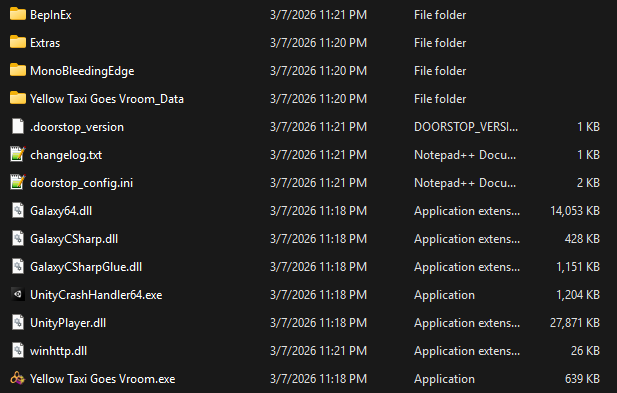
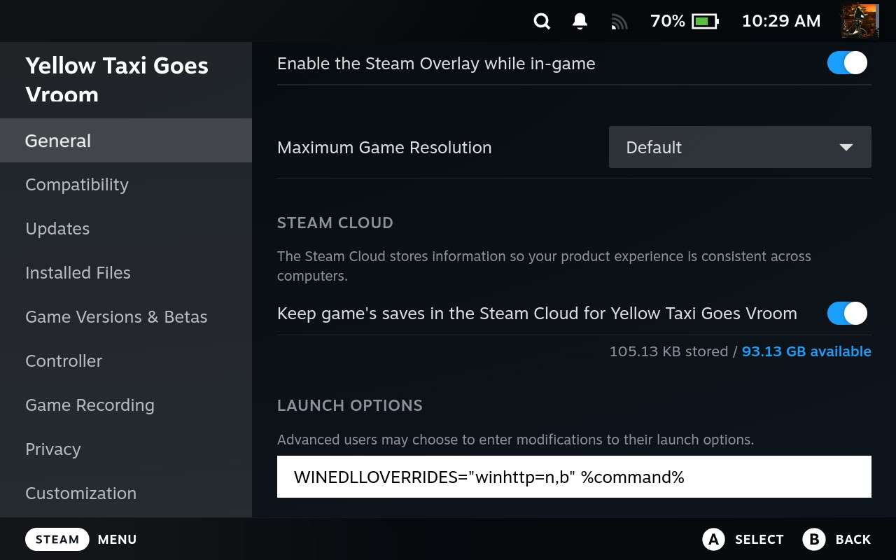

# Yellow Taxi Goes Vroom Randomizer Setup Guide

## Required Software
- A [Steam](https://store.steampowered.com/app/2011780/Yellow_Taxi_Goes_Vroom/) or [GOG](https://www.gog.com/en/game/yellow_taxi_goes_vroom) PC copy of Yellow Taxi Goes Vroom
- The [latest mod](https://github.com/soopercool101/YellowTaxiAP/releases/latest)

## Optional Software
- [Archipelago](https://github.com/ArchipelagoMW/Archipelago/releases/latest)

## Installation
- Download the .zip file in the latest release of the mod (***NOT THE SOURCE CODE***)
- Extract it into the root of your game directory. Your folder should look something like this:

- ***Linux only, including Steam Deck:*** Add `WINEDLLOVERRIDES="winhttp=n,b" %command%` to your launch options, like so:

## How to play
On the game's main menu, it should prompt you for slot details, add the player name and room link and click "connect".
The game should start immediately, bypassing the file select screen.

If you're playing a Steam copy in Big Picture mode, you can go through this setup fully via controller. Clicking through the title screen will pull up your on-screen keyboard.
